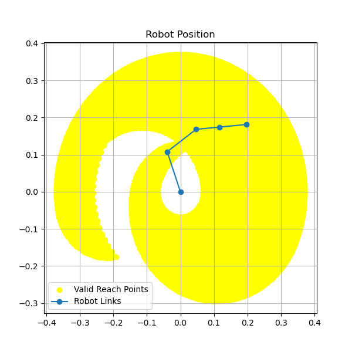

# Robot Arm Lifting Capacity Calculator

Simulation of the lifting capacity of a robot arm. 
It calculates joint torques based on user-defined joint angles and payload, checks motor torque limits, and visualizes valid reach points.

## Usage

Run the script from the command line, optionally specifying joint angles:
```bash
python calc_robot_lifting_capacity.py [main_boom_angle] [second_boom_angle] [wrist_angle]
```

- `main_boom_angle`: Angle of the main boom in degrees to the horizontal axis (default: 110)
- `second_boom_angle`: Angle of the second boom in degrees to the main-boom axis (default: -75)
- `wrist_angle`: Vertical angle of the wrist in degrees to the second-boom axis (default: -30)
- `--payload`: Payload in kg (default: 0.0)

### Example

```bash
python calc_robot_lifting_capacity.py 90 -45 -30 --payload 0.2
```

This calculates the maximum payload and plots the reach area for the specified angles.

## Example Output

- **Max Payload**: Maximum weight that can be lifted at the specified angles.
- **Max Payload Fully Stretched**: Maximum weight that can be lifted when robot is full stretched.
- **Reach Plot**: Visualization of the robot position and the valid reach points for the specified payload.

### Reach Plot Example



